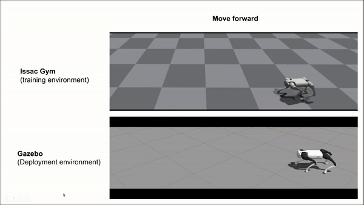

# Go1-RL-Controller
## Introduction

This repo provides a quadruped control stack that controls the Unitree Go1 robot, one of the most popular quadruped robots used in academic research in recent years. This control stack implements model free reinforcement learning control methods. Additionally, we use Docker and ROS1 to make it easy to install and develop.

To facilitate quadruped research and application development, we provide interfaces to use this controller to control either simulated robots or real robots. We support following types of robots

    1. Go1 Robot simulated in Gazebo Simulator
    2. Go1 Robot hardware (coming soon)

Even if you do not have an Go1 robot hardware, our simulation setup can let you do research in either the Gazebo simulator. Various efforts have been done to reduce the sim2real gap in this work. 

## Controller Installation
Will update for full installation procedure later. For now, please use google doc for reference.

https://docs.google.com/document/d/1oeaLzuxC3kVKrw5ra6BAsyoRr79fPUHETEeBppi0BQo/edit

## Controller Learning
Train in issac gym, in which we can achieve a massive parallel reinforcement learning pipeline. Details will be updated later.

## Gazebo Demo
Open the gazebo
```shell
roslaunch unitree_gazebo normal.launch rname:=go1
```




### Adjust the robot in the Gazebo
During the development, we can let the robot stand up by two Unitree testing scripts. The following two commands are very handy.
```shell
rosrun unitree_controller unitree_servo # let the robot stretch legs
rosrun unitree_controller unitree_move_kinetic # place the robot back to origin
```
We oftern running the two commands alternatively by running one and ctrl-C after a while to adjust the pose of the robot.
After the robot properly stands up, it is ready to be controlled. 

### Start the controller

If you have completed the instructions before, there should be a runnable docker container called `a1_cpp_ctrl_docker` in your computer. 
Run the container, build and config the A1 controller

In the docker container, continue to run the controller
```shell
roslaunch roslaunch go1_rl_ctrl_cpp go1_ctrl.launch 
```

Now, the controller engages the robot in Gazebo. The robot has two modes: "stand" (default) and "walk". The robot still stands at the beginning. If using QP controller, your robot may be not very stable when standing up, you can use the two unitree_controller commands we mentioned above to adjust the robot to make it stands up first. The Convex MPC controller is more stable. 

Different computers have different performance. If the robot is very unstable, chances are the simulation parameters of the Gazebo needs to be tuned (unitree_ros/unitree_gazebo/worlds). See [Gazebo tutorial](https://gazebosim.org/tutorials?tut=physics_params&cat=physics) for more information.

Connect a USB joystick to the host computer.

Currently, we need a Linux-supported joystick like an Xbox One Controller to drive the robot around.
You should follow the instructions in http://wiki.ros.org/joy/Tutorials/ConfiguringALinuxJoystick to learn how to setup a joystick controller.

Take Xbox One Controller as an example:

| Button | Function |
| :----- | :------- |
| Left Joystick | Control the robot's yaw orientation |
| Right Joystick | Control the robot's walking direction |
| `A`| Switch the mode between "stand" and "walk" |


## Troubleshooting
Please create issues for any installation problem. 

## Acknowledgement
We referenced the controller architecture written by Shuo Yang and Zixin Zhang in there A1-QP-MPC-Controller.
